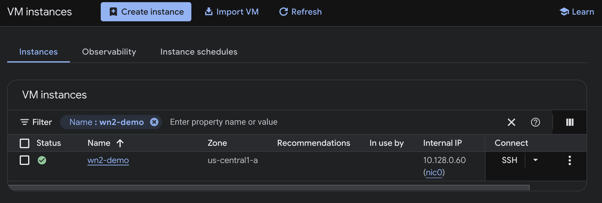
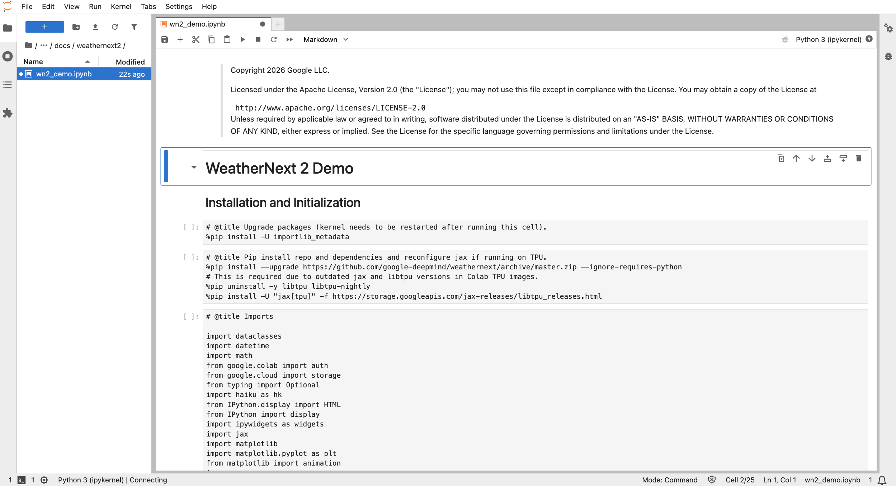

# Running the WeatherNext 2 demo on a Cloud TPU VM

[WeatherNext 2](https://github.com/google-deepmind/weathernext) is the global,
medium-range weather and cyclone model from Google DeepMind and Google Research.

In this guide you will provision a Cloud TPU VM, set up a Python environment
that runs the
[published demo notebook](https://github.com/google-deepmind/weathernext/blob/main/docs/weathernext2/wn2_demo.ipynb),
and produce your first ensemble forecast and cyclone tracks.

## What you'll run

WeatherNext 2 is published in two sizes:

Model                                  | Resolution | Checkpoint               | Latent | Layers | Heads
:------------------------------------- | :--------- | :----------------------- | -----: | -----: | ----:
**`WeatherNextCyclones_Mini`**         | **1°**     | **216 MiB, single file** | 512    | 16     | 4
`WeatherNextCyclones` / `WeatherNext2` | 0.25°      | 701 MiB × 4 seeds        | 768    | 24     | 6

The demo points to `WeatherNextCyclones_Mini` by default.

## Before you begin

You need a Google Cloud project with billing attached. The $300 Free Trial does
not cover TPUs, so you need credits or a paid account.

```shell
gcloud auth login
gcloud config set project <YOUR_PROJECT_ID>
gcloud services enable compute.googleapis.com
```

```shell
export PROJECT_ID=<YOUR_PROJECT_ID>
export TPU_NAME=wn2-demo
export MACHINE_TYPE=ct6e-standard-1t
export ZONE=us-east5-a
export LOCATION=us-east5
```

v6e is offered in
[several zones](https://cloud.google.com/tpu/docs/regions-zones). If a `create`
fails for capacity, try another zone, and if none of them work, try again later.

Check [TPU pricing](https://cloud.google.com/tpu/pricing) before you start.

## Create the TPU VM

```shell
gcloud compute instances create $TPU_NAME \
    --project=$PROJECT_ID \
    --zone=$ZONE \
    --machine-type=$MACHINE_TYPE \
    --image-family=ubuntu-accel-2204-amd64-tpu-v5e-v5p-v6e \
    --image-project=ubuntu-os-accelerator-images \
    --maintenance-policy=TERMINATE \
    --scopes=https://www.googleapis.com/auth/cloud-platform
```

Two flags are not optional. `--maintenance-policy=TERMINATE` is required because
TPUs cannot be live-migrated. `--image-family` must be the TPU image. The one
named here covers v5e, v5p and v6e.

### Confirm it came up

Open
[Compute Engine → VM instances](https://console.cloud.google.com/compute/instances)
in the Cloud Console. Your VM should be listed with a green check, the name you
gave it, the zone, and `ct6e-standard-1t` in the Machine type column.



Same check from the terminal, if you prefer:

```shell
gcloud compute instances describe $TPU_NAME --zone=$ZONE \
    --format='value(name,status,machineType.basename())'
```

You want `RUNNING` and the machine type you asked for.

## Connect, open and run the notebook

```shell
gcloud compute ssh $TPU_NAME --project=$PROJECT_ID --zone=$ZONE -- -L 8888:localhost:8888
```

The `-L 8888:localhost:8888` forwards the VM's port to your laptop, so the URL
Jupyter prints opens in your own browser. If the first connection is refused,
wait thirty seconds. SSH comes up slightly after the instance reports `RUNNING`.

On the VM, the image ships Python but no `pip` and no `uv`, so the first two
lines bootstrap them:

```shell
sudo apt-get update -qq && sudo apt-get install -y -qq python3-pip
python3 -m pip install -q uv
export PATH="$HOME/.local/bin:$PATH"

uv venv --python 3.12 --seed .venv
source .venv/bin/activate

uv pip install -q jupyterlab google-cloud-storage ipywidgets h5py "pandas<3"

git clone https://github.com/google-deepmind/weathernext.git
jupyter lab --no-browser --port=8888
```

Open the printed `http://localhost:8888/?token=…` URL, browse to
`weathernext/docs/weathernext2/wn2_demo.ipynb`, and run it from the top.

If the SSH session drops, reconnect and run `source .venv/bin/activate` before
starting Jupyter again.



**Saving the forecast to your own bucket.** The demo holds it in memory only, so
to keep what you generated, write it to a bucket in your own project.

Create the bucket once, from your laptop:

```shell
gcloud storage buckets create gs://$PROJECT_ID-weathernext --location=$LOCATION
```

Then add a cell at the end of the notebook. The VM already has credentials, so a
plain `storage.Client()` picks up the service account:

```python
from google.cloud import storage

bucket_name = "YOUR_PROJECT_ID-weathernext"
blob_name = "forecasts/2024-10-07_mini.nc"

# Pick the variables you need
subset = predictions[[
    "2m_temperature",
    "10m_u_component_of_wind",
    "10m_v_component_of_wind",
]]

subset.to_netcdf("/tmp/forecast.nc", engine="h5netcdf")

storage.Client().bucket(bucket_name).blob(blob_name).upload_from_filename(
    "/tmp/forecast.nc")

print(f"wrote gs://{bucket_name}/{blob_name}")
```

To read your prediction back (using credentials on the project):

```python
with storage.Client().bucket(bucket_name).blob(blob_name).open("rb") as f:
    forecast = xarray.open_dataset(f, engine="h5netcdf").load()
```

## Clean up

```shell
gcloud compute instances delete $TPU_NAME --project=$PROJECT_ID --zone=$ZONE --quiet
```

Refresh
[Compute Engine → VM instances](https://console.cloud.google.com/compute/instances).
The VM should be gone from the list.

Or from the terminal:

```shell
gcloud compute instances list --filter="name=$TPU_NAME"
```

An empty result is what you want.

The VM is the only thing billing by the hour. Model weights and initial
conditions come from a public bucket you do not own, so they cost nothing. If
you saved a forecast to your own bucket, that storage does keep costing until
you remove it:

```shell
gcloud storage rm -r gs://$PROJECT_ID-weathernext
```

## What's next: scaling up

Below we discuss how to scale in two ways: running more ensemble members at
once, and running a bigger model.

### More ensemble members at once

The demo parallelises with `pmap(..., dim="sample")`, which spreads ensemble
members across chips. On one chip the default 8 members run as eight sequential
passes; on eight chips, as one. More chips means a faster run, not a different
result.

You want                             | Use                | Members per pass
:----------------------------------- | :----------------- | :---------------
The default 8 members, one at a time | `ct6e-standard-1t` | 1
The same 8 members, 4× fewer passes  | `ct6e-standard-4t` | 4
All 8 members in a single pass       | `ct6e-standard-8t` | 8

Keep `num_ensemble_members` a multiple of the chip count.

> **`ct6e-standard-8t` needs one extra flag** on the create command in **Create
> the TPU VM**: `--threads-per-core=1`. The 1-chip and 4-chip sizes do not.

### The bigger 0.25° models

**Use `ct5p-hightpu-4t`.** That is what the repository recommends for
`WeatherNext2` and `WeatherNextCyclones`, and it is the configuration these
models are known to run on.

Set it in **Before you begin** and everything else in this guide is unchanged:

```shell
export MACHINE_TYPE=ct5p-hightpu-4t
export ZONE=us-east5-a
```

In the "Load the weights, params and data" cell of the notebook, set the model,
a split it was trained for, and the matching resolution:

```python
model_name = "WeatherNext2"
split = "2025"
data_resolution = "0.25"
steps = "04"

# The bigger models ship one file per model seed, so the path needs a suffix.
weights_path = f"weathernext2/params/{model_name}_<{split}_model1.npz"
```

On a v5p, also comment out the block in the "Build jitted functions" cell that
overrides the splash attention block sizes:

```python
transformer_kwargs.update({
    'block_q': 128,
    'block_kv': 128,
    'block_kv_compute': 128,
    'block_q_dkv': 128,
    'block_kv_dkv': 128,
    'block_kv_dkv_compute': 128,
})
```

Those smaller tiles are there to fit the model on a v5e-1. A v5p has enough
memory for the default block sizes, and leaving them alone is faster.

One last thing. Splits differ by model. `WeatherNextCyclones_Mini` has 2023 and
2024, `WeatherNextCyclones` has 2023 through 2025, and `WeatherNext2` has 2025
only. Check what exists before you edit:

```shell
gcloud storage ls "gs://dm_graphcast/weathernext2/params/"
```

## Congratulations

You provisioned a Cloud TPU VM from scratch and ran the published WeatherNext 2
demo on it, from an empty project to an ensemble forecast and cyclone tracks.

### Additional resources

-   **Read the papers** behind the models:
    [Operational Tropical Cyclone Forecasting with AI](https://www.nature.com/articles/s41586-026-10953-2)
    and
    [skillful joint probabilistic weather forecasting](https://arxiv.org/abs/2506.10772)
-   **Skip the model entirely** if you only want the forecasts. They are
    published as daily feeds through
    [Google Cloud](https://developers.google.com/weathernext/guides/access-forecast),
    [WeatherLab](https://deepmind.google.com/science/weatherlab) and
    [OpenMeteo](https://open-meteo.com/en/docs/google-weathernext-api)

## Reference

-   [WeatherNext repository](https://github.com/google-deepmind/weathernext) and
    the
    [demo notebook](https://github.com/google-deepmind/weathernext/blob/main/docs/weathernext2/wn2_demo.ipynb)
-   [Create a TPU VM instance (Compute Engine)](https://cloud.google.com/compute/docs/tpus/create-tpu-vm-instance)
-   [TPU machine types](https://cloud.google.com/compute/docs/tpus/tpu-machines)
-   [TPU regions and zones](https://cloud.google.com/tpu/docs/regions-zones)
-   [Create TPU Flex-start VMs with Compute Engine](https://cloud.google.com/tpu/docs/create-flex-start-compute)
-   [Cloud TPU pricing](https://cloud.google.com/tpu/pricing)
